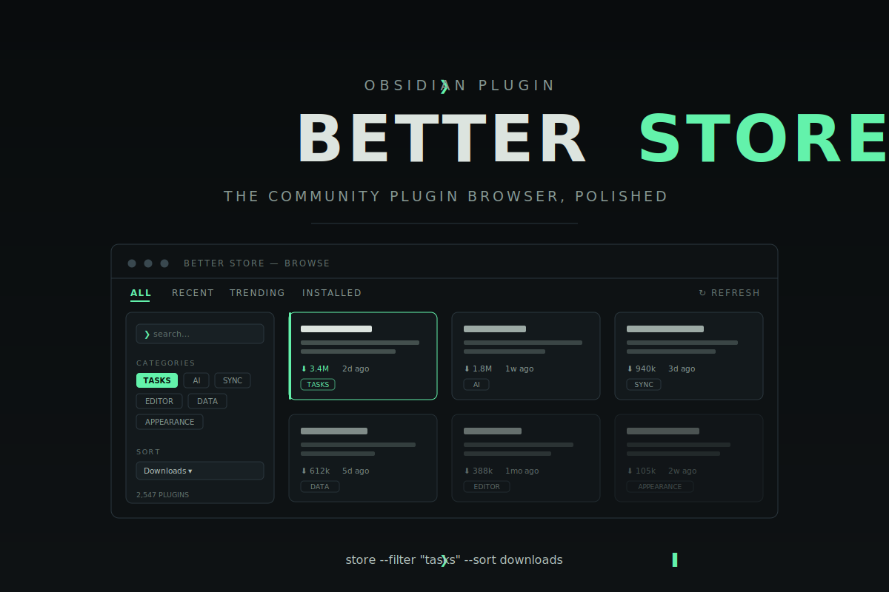

[](docs/assets/banner.svg)

<div align="center">

[](LICENSE)
[](https://github.com/Real-Fruit-Snacks/obsidian-better-store/releases/latest)
[](https://obsidian.md)
[](https://github.com/Real-Fruit-Snacks/obsidian-better-store/actions/workflows/ci.yml)
[](https://community.obsidian.md/plugins/better-store)

**[Documentation site](https://real-fruit-snacks.github.io/obsidian-better-store/)** · **[Latest release](https://github.com/Real-Fruit-Snacks/obsidian-better-store/releases/latest)** · **[Changelog](CHANGELOG.md)**

</div>

## Overview

Better Store is an [Obsidian](https://obsidian.md) plugin that replaces day-to-day use of the built-in community plugin browser. It opens as a full workspace tab with real filters, heuristic categories, rendered README previews, GitHub stats, a trending view, and a dashboard for the plugins you already have installed.

It deliberately does **not** install, update, or remove plugin files itself — install actions hand off to Obsidian's native Community Plugins dialog, so nothing about your vault's security model changes.

## Features

- **Full workspace view** — a filter sidebar, card grid, and detail pane instead of a cramped modal; opens in a tab, a split, or its own window. Stays open while you work.
- **Filters & sorting** — search across name/author/description, category chips, "updated within", minimum downloads, hide installed; sort by downloads, recency, name, or trending.
- **Heuristic categories** — Tasks, Sync & Backup, AI, Appearance, Editor, Export & Import, Calendar & Time, Data & Queries, Files & Organization, Publishing & Sharing, Integrations. The official registry has no categories, so these are keyword-derived — imperfect by design and easy to refine.
- **Rich details** — rendered README with images (sanitized), GitHub stars and open issues, recent releases, and funding links, fetched lazily and cached.
- **Trending** — local download-delta tracking across catalog refreshes. Builds up as you use the plugin; no external service, no telemetry.
- **Installed dashboard** — current vs. latest version, update badges, enable/disable toggles (with bulk select), "stale" warnings for plugins unmaintained for a year+, changelog links.
- **Tree view** — an explorer-style layout with folders derived from the active sort (download tiers, recency, A–Z, trending), a collapsed Stale folder, persistent expansion, and indent guides.
- **Quick jump** — a fuzzy search command (`Better Store: Search plugins`) that opens any plugin's details from anywhere in Obsidian.
- **"New" detection** — plugins that entered the registry in the last 14 days get a badge and a "New only" filter (togglable).
- **Favorites** — star plugins to track them; a "Starred only" filter keeps your watchlist one click away.
- **Update notifications** — a background check marks the ribbon icon (and optionally shows a notice) when installed plugins have updates.
- **Release notes inline** — expand any release in the detail pane to read its changelog without leaving Obsidian.
- **Compatibility warnings** — flags plugins whose `minAppVersion` exceeds your Obsidian version before you install.
- **Keyboard navigation** — arrow keys move through cards and tree rows, Enter opens details, Esc closes the pane.
- **Ignore rules** — hide individual plugins, everything by an author, or whole categories.
- **Plugin profiles** — save named enable-sets ("Writing", "Minimal") and switch between them in one click, from the Installed tab or the command palette.
- **Export / import** — copy your installed list as Markdown or JSON; paste a list back to see what's missing and star it as an install shopping list.
- **Maintenance health** — a healthy / aging / at-risk chip on the detail pane from update recency and release cadence (togglable).
- **Download history** — a sparkline built from your own catalog snapshots (togglable).
- **Similar plugins** — related plugins by shared categories and keywords, one click away in the detail pane (togglable).
- **Filter presets** — save sidebar filter combinations under a name and reapply them from a dropdown.
- **Copy actions** — repository URL and BRAT string copy buttons in the detail pane.

## Installation

### From Community Plugins (recommended)

Better Store is in the official directory: Settings → Community plugins → Browse → search **Better Store** → Install. Or open the [community listing](https://community.obsidian.md/plugins/better-store).

### Manual

1. Download `main.js`, `manifest.json`, and `styles.css` from the [latest release](https://github.com/Real-Fruit-Snacks/obsidian-better-store/releases/latest).
2. Place them in `YourVault/.obsidian/plugins/better-store/`.
3. Settings → Community plugins → enable **Better Store**.

Release assets carry [GitHub artifact attestations](https://docs.github.com/en/actions/security-for-github-actions/using-artifact-attestations) — verify provenance with `gh attestation verify main.js -R Real-Fruit-Snacks/obsidian-better-store`.

## Getting Started

Open the store from the ribbon icon or the command palette (`Better Store: Open store`).

### Commands

| Command | Action |
| --- | --- |
| `Better Store: Open store` | Opens (or reveals) the store — in a tab, split, or window per your setting |
| `Better Store: Search plugins` | Fuzzy quick-jump to any plugin's details (recently viewed rank first) |
| `Better Store: Apply plugin profile` | Switch to a saved enable-set |
| `Better Store: Export plugin list (Markdown / JSON)` | Copies your installed list to the clipboard |
| `Better Store: Import plugin list` | Paste an exported list and see what's missing |

### Settings

| Setting | Default | What it does |
| --- | --- | --- |
| GitHub token | — | Optional. Link a secret from **Obsidian's secret storage** holding a GitHub personal access token — it raises the API rate limit (60/hr without) used for stars, issues, and releases. A classic token with **no scopes** is enough. Only the secret's *name* is stored in plugin data; the token itself never leaves secret storage. The token is verified automatically when linked, and a **Test** button re-checks it anytime, reporting your remaining rate limit. |
| Cache lifetime | 12 h | How long the plugin catalog is cached. Manual refresh in the store header. |
| Default sort | Downloads | Downloads, recently updated, name, or trending. |
| Open the store in | Tab | Tab, split, or a new window (desktop-only; falls back to a tab on mobile). |
| Hide installed by default | Off | Start browsing with installed plugins hidden. |
| Show "New" badges | On | Highlight plugins that entered the registry in the last 14 days. |
| Track recently viewed | On | Ranks recently opened plugins first in quick-jump search. |
| Detail pane toggles | On | Maintenance health chip, similar plugins, download history chart — each individually togglable. |
| Profiles / Filter presets | — | Review and delete saved profiles and presets. |
| Check for updates in the background | On | Checks installed plugins on the cache-lifetime cadence and marks the ribbon icon. |
| Notify when updates are found | On | Shows a notice when the background check finds updates. |
| Starred plugins | — | Review and unstar favorites. |
| Ignored plugins / authors / categories | — | Review and remove any ignore rule. |

## How It Works

- The catalog comes from the official `obsidianmd/obsidian-releases` registry and stats files. The multi-megabyte stats file is slimmed to totals + last-updated timestamps and cached inside the plugin's own folder.
- Detail-view data (README, stars, releases) is fetched lazily per plugin — READMEs from `raw.githubusercontent.com` (no rate limit), API data from GitHub with your optional token.
- Trending compares download counts across your own catalog refreshes (snapshots kept locally, capped at 30).
- READMEs are third-party content: they're rendered through Obsidian's `MarkdownRenderer` and then passed through Obsidian's DOMPurify-backed sanitizer as defense in depth. Funding links are only accepted with `http(s)` schemes.
- Enable/disable toggles use an internal Obsidian API (the same one used by well-known plugin managers). If a future Obsidian update changes it, those toggles may stop working until this plugin updates — everything else is unaffected.

## Architecture

```
src/
├── main.ts              plugin entry: commands, service wiring, update checks
├── view.ts              ItemView hosting the Svelte root
├── settings.ts          declarative settings tab
├── data/                pure, fully unit-tested modules (no Obsidian imports)
│   ├── registry.ts      registry parsing + stats slimming
│   ├── categories.ts    keyword → category heuristics
│   ├── filter.ts        filter/sort engine
│   ├── tree.ts          sort-derived folder grouping
│   ├── trending.ts      download-delta snapshots + history
│   ├── newness.ts       new-plugin detection
│   ├── service.ts       fetch + cache orchestration (IO injected)
│   ├── installed.ts     installed-plugin status
│   ├── profiles.ts      enable-set diffing
│   ├── portability.ts   export/import of plugin lists
│   ├── health.ts        maintenance assessment
│   ├── similar.ts       related-plugin scoring
│   └── ...              versions, readme URL rewriting, formatting
└── ui/                  Svelte 5 components
    ├── StoreView.svelte tabs, state, wiring
    ├── FilterSidebar / PluginCard / DetailPane / InstalledTab
    ├── TreeView / Sparkline / Icon
    ├── QuickJumpModal / modals (name prompt, import, profiles)
    └── store-context.ts typed access to Obsidian internals
```

## Privacy & Permissions

- **Network** — requests go only to the official `obsidianmd/obsidian-releases` registry, `raw.githubusercontent.com`, and `api.github.com`. No telemetry, no third-party services.
- **Clipboard** — write-only, and only when you click a copy/export action. The plugin never reads your clipboard.
- **Storage** — settings and UI state live in Obsidian's plugin data (`data.json`); caches live in the plugin's own folder; the optional GitHub token lives in Obsidian's secret storage — plugin data records only the linked secret's name, never the token.

## Self-hosting

The repository ships a `.gitlab-ci.yml`, so the project can also be hosted and built on a self-hosted GitLab instance — the pipeline runs the same verify/build steps, publishes the plugin files as artifacts, and serves the docs site via GitLab Pages.

## Development

```bash
npm install
npm run dev            # watch build
npm run check          # TypeScript type check
npm run check:svelte   # Svelte component type check
npm test               # unit tests (90)
npm run build          # production build + bundle verification
```

Junction/symlink the repo into a test vault's `.obsidian/plugins/better-store` and enable it.

## License

[MIT](LICENSE)
